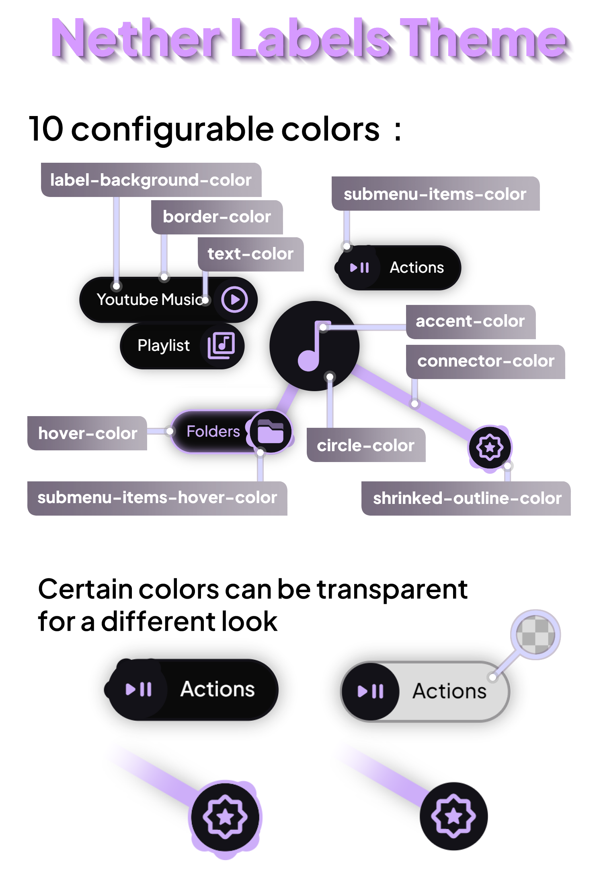

<!--
SPDX-FileCopyrightText: Elfi Ox <https://github.com/elfi-ox>
SPDX-License-Identifier: CC-BY-4.0
-->

With its dark and classy colors, this theme features labels on your items and submenus and a sleek overall appearance. If however, your style is more bright or flashy, you can fully customize this theme with its 10 colors options.

  
  

This theme is a Modified version of the "Rainbow Labels" theme made by Simon Schneegans.
